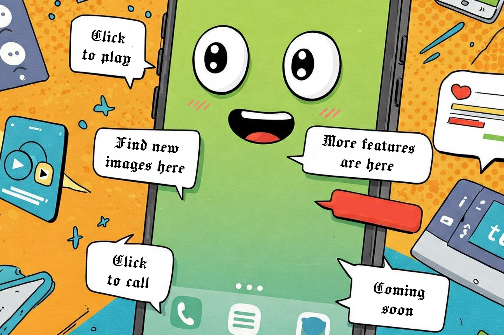
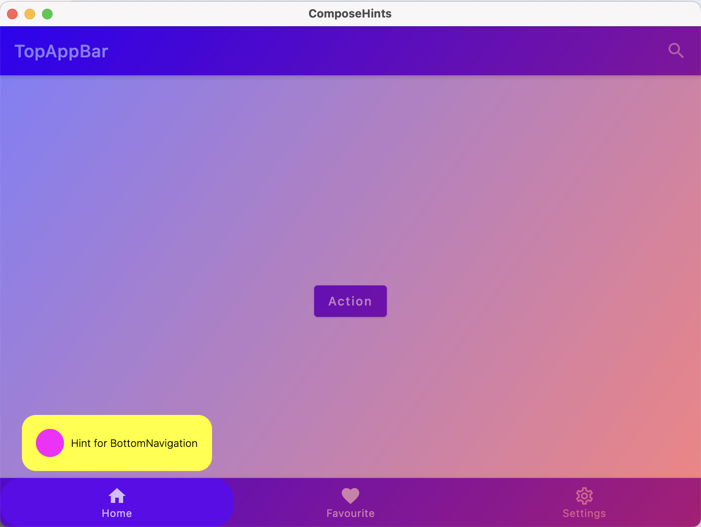
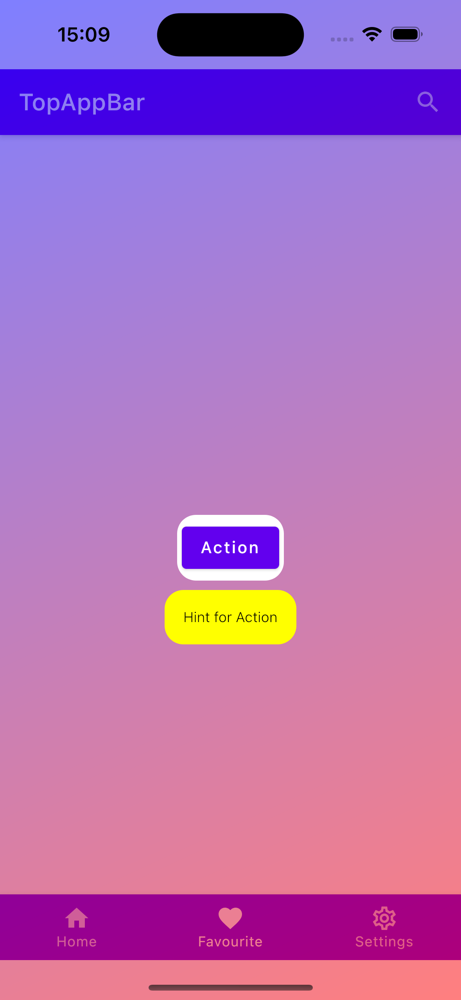
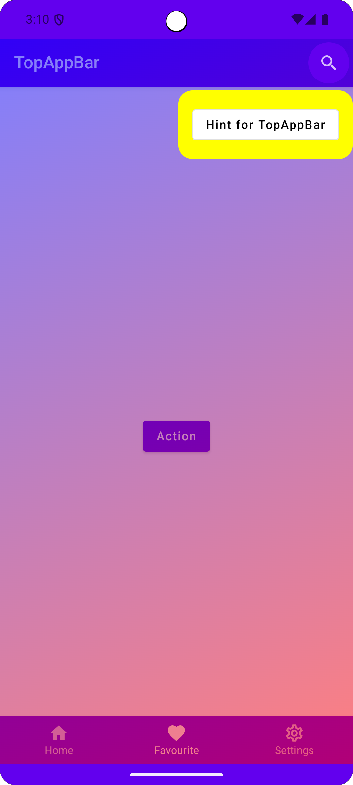

# ComposeHints



[](https://central.sonatype.com/search?namespace=com.viktormykhailiv&name=compose-hints)
[](http://kotlinlang.org)
[](https://kotlinlang.org/docs/multiplatform.html)
[](https://www.jetbrains.com/compose-multiplatform/)
[](https://github.com/vitoksmile/ComposeHints/blob/main/LICENSE.txt)

## What is ComposeHints?

ComposeHints is a Compose Multiplatform (Android, iOS, Web, Desktop) library to show hints /
tooltips, pointing to a particular UI element.



&emsp;&emsp;&emsp;
&emsp;&emsp;&emsp;&emsp;

## Quick Start

First add the dependency to your project:

```toml
[versions]
hints = "3.1.1"

[libraries]
compose-hints = { module = "com.viktormykhailiv:compose-hints", version.ref = "hints" }

[plugins]
```

```
implementation(libs.compose.hints)
```

```kotlin
repositories {
    mavenCentral()
}

dependencies {
    implementation("com.viktormykhailiv:compose-hints:3.1.1")
}
```

To show a hint we need wrap root Composable with `HintHost`, configure `HintController`, 
`Hint` composable, and `hintAnchor` Modifier along with `HintAnchorState`:

```kotlin
val coroutineScope = rememberCoroutineScope()
val hintController = rememberHintController()

// Build UI for the hint
val hint = rememberHint {
    Text("Hello World")
}
// Create an anchor's state
val hintAnchor = rememberHintAnchorState(hint)

Button(
    modifier = Modifier
        // Configure the anchor
        .hintAnchor(hintAnchor, shape = RoundedCornerShape(16.dp))
        .padding(16.dp),
    onClick = {
        // Show the hint
        coroutineScope.launch {
            hintController.show(hintAnchor)
            // Do something here after the hint was shown
        }
    },
) {
    Text("Show hint")
}
```

> Note: Modifier ordering always matter in Compose, we set `16.dp` after `hintAnchor` modifier to
> have extra space around this button (the anchor's size will be bigger by 16.dp that the actual
> button's size).

## Customizations

### Full-screen Hints

Sometimes you want to show a general introductory or welcome hint that doesn't point to a 
specific UI element. You can achieve this by setting `fullScreen = true` in the `hintAnchor` modifier.

```kotlin
Modifier.hintAnchor(welcomeHintAnchor, fullScreen = true)
```

In this mode:
- The specific UI element's position and size are ignored.
- No highlighted "hole" is drawn in the background.
- The hint is positioned relative to the top-left of the `HintHost`.

### Show many hints (Sequences)

You are not limited in showing only 1 hint. `HintController` allows you to show a sequence of hints 
that the user can navigate through. The `show` function is a **suspend** function that resumes only 
after the entire sequence is completed or dismissed.

```kotlin
coroutineScope.launch {
    hintController.show(
        topAppBarActionHintAnchor,
        actionHintAnchor,
        bottomNavigationHintAnchor,
    )
    // Resumes here after all hints in the sequence are dismissed
}
```

#### Sequence Navigation

You can manually control the sequence navigation using `next()` and `previous()` methods. This is 
useful for building "Next" and "Back" buttons within your hint UI. `HintController` also provides 
state properties to help you build the navigation UI.

```kotlin
val hint = rememberHint {
    Column {
        Text("Step ${hintController.currentStepIndex + 1} of ${hintController.totalStepsCount}")
        
        Row {
            if (hintController.hasPrevious) {
                OutlinedButton(onClick = { hintController.previous() }) {
                    Text("Back")
                }
            }
            
            Button(onClick = { hintController.next() }) {
                Text(if (hintController.hasNext) "Next" else "Finish")
            }
        }
    }
}
```

- `next()`: Moves to the next hint. If it's the last one, dismisses the sequence.
- `previous()`: Moves to the previous hint.
- `currentStepIndex`: 0-based index of the current hint.
- `totalStepsCount`: Total number of steps in the active sequence.
- `hasNext` / `hasPrevious`: Helper properties for UI logic.
- `dismiss()`: Immediately dismisses the entire sequence.

### Multiple Anchors per Hint

You can highlight multiple UI elements simultaneously for a single explanation using `showGroup`. 
The hint will automatically position itself relative to the collective bounding box of all 
active anchors.

```kotlin
hintController.showGroup(listOf(anchor1, anchor2))
```

### Hint style

There are no limitations how your hints can look like. ComposeHints library uses "slot" approach
where you pass your own Composable content which should be shown as a hint. The library only
provides a possibility to draw an overlay, calculate anchor's coordinates, and clip shapes.

E.g. we can build an app specific hint implementation with background and some paddings.

```kotlin
@Composable
fun rememberHintContainer(content: @Composable () -> Unit): Hint {
    return rememberHint {
        Box(
            modifier = Modifier
                .padding(vertical = 8.dp)
                .background(Color.Yellow, shape = RoundedCornerShape(16.dp))
                .padding(16.dp),
        ) {
            CompositionLocalProvider(
                LocalTextStyle provides TextStyle(
                    color = Color.Black,
                    fontSize = 12.sp,
                    fontWeight = FontWeight.Light,
                ),
            ) {
                content()
            }
        }
    }
}
```

And in our apps we will our new `rememberHintContainer` composable:

```diff
// Build UI for the hint
-val hint = rememberHint {
+val hint = rememberHintContainer {
    Text("Hello World")
}
```

### Hint Properties

Each `Hint` can be configured with `HintProperties`:
- `dismissOnBackPress`: whether the hint can be dismissed by pressing the back button.
- `dismissOnClickOutside`: whether the hint can be dismissed by clicking outside its bounds.
- `alignment`: where the hint should appear relative to the anchor (e.g., `Top`, `EndTop`, `Center`).
- `padding`: the distance (gap) between the hint content and its anchor.
- `holePadding`: the padding around the anchor to expand the "hole" (the highlighted area) without affecting the UI layout.
- `autoAdvanceDuration`: the duration after which the hint will automatically move to the next step.
- `offset`: additional manual adjustment via `DpOffset`.

```kotlin
rememberHint(
    properties = HintProperties(
        dismissOnBackPress = false,
        alignment = HintAlignment.EndTop,
        padding = 8.dp,
        holePadding = 4.dp, // Highlight area is 4dp bigger than the button
        autoAdvanceDuration = 5.seconds, // Automatically moves to next after 5s
        offset = DpOffset(x = 4.dp, y = 0.dp),
    ),
) {
    // Hint content here
}
```

### Advanced Positioning

ComposeHints provides a flexible alignment system with built-in **Smart Flipping** and **RTL Awareness**.

#### Alignment Options
You can choose from several alignment strategies:
- **Basic**: `Top`, `Bottom`, `Start`, `End`, `Center`, `Overlap`.
- **Specific**: `TopStart`, `TopEnd`, `BottomStart`, `BottomEnd`, `StartTop`, `StartBottom`, `EndTop`, `EndBottom`.

#### Smart Flipping
If a hint is set to `Top` but there isn't enough space above the anchor, the library will 
automatically flip it to the `Bottom` to ensure it remains visible. This works for all specific 
alignments as well (e.g., `EndTop` will flip to `StartTop` if it hits the screen edge).

#### RTL Awareness
Alignments like `Start` and `End` are automatically mirrored in Right-to-Left (RTL) layouts, so 
your onboarding flows will look correct for all users without any extra code.

### Overlay customization

By default the background overlay has scrimColor as `Color(0x44000000)`. You can customize it 
globally for all hints in a `HintHost`, or specifically for a `HintController`.

#### Global Customization (via HintHost)
Setting the overlay at the `HintHost` level ensures all hints in your app (or that specific screen) 
share the same background style.

```kotlin
HintHost(
    overlay = Color.Red.copy(alpha = 0.4f)
) {
    // All hints shown here will have a red overlay by default
}
```

#### Local Customization (via HintController)
There is also an option to provide either a `Color` or `Brush` directly to `rememberHintController`. 
This will override the global default from `HintHost`.

```kotlin
val hintController = rememberHintController(overlay = Color.Red)

// or set Brush:
val hintController = rememberHintController(
    overlay = Brush.linearGradient(
        listOf(
            Color.Blue.copy(alpha = 0.5f),
            Color.Red.copy(alpha = 0.5f),
        )
    ),
)
```

### Overlay enter/exit animations

By default the background overlay appears/disappears with fade in/out animations. Those animations
can be customized with `overlayEnterTransition` and `overlayExitTransition`:

```kotlin
val hintController = rememberHintController(
    overlayEnterTransition = fadeIn(tween(durationMillis = 1_000)),
    overlayExitTransition = fadeOut(tween(durationMillis = 1_000)),
)
```

### Hint enter/exit animations

By default the hint appears/disappears with no animation. The animation can be customized
with using `Modifier.animateEnterExit`.

```kotlin
val hint = rememberHint {
    Text(
        modifier = Modifier
            .animateEnterExit(
                enter = fadeIn(tween(1_000)) + scaleIn(tween(1_000)),
                exit = fadeOut(tween(1_000)) + scaleOut(tween(1_000))
            ),
        text = "Hello World",
    )
}
```

### Anchor size animation

By default hint's anchor clips overlay with [scale animation](https://youtu.be/C245qYbB_w4). 
The animation mode and specs can be customized.

```kotlin
val hintController = rememberHintController(
    anchorAnimationMode = HintAnchorAnimationMode.Scale,
    anchorSizeAnimationSpec = tween(durationMillis = 1_000),
    anchorOffsetAnimationSpec = tween(durationMillis = 1_000),
)
```

You can apply ["follow" animation mode](https://youtu.be/EyLt7emss1w) in which anchor's position is animated from the 
previous to next (moving anchor's rect on the screen).

```kotlin
val hintController = rememberHintController(
    anchorAnimationMode = HintAnchorAnimationMode.Follow,
)
```

### Clip shape

By default `RectangleShape` is used to provide a shape around anchors. `hintAnchor` modifier accepts
`Shape` as a parameter to override it.

```kotlin
Modifier.hintAnchor(hintAnchor, shape = RoundedCornerShape(16.dp))

Modifier.hintAnchor(hintAnchor, shape = CircleShape)
```
