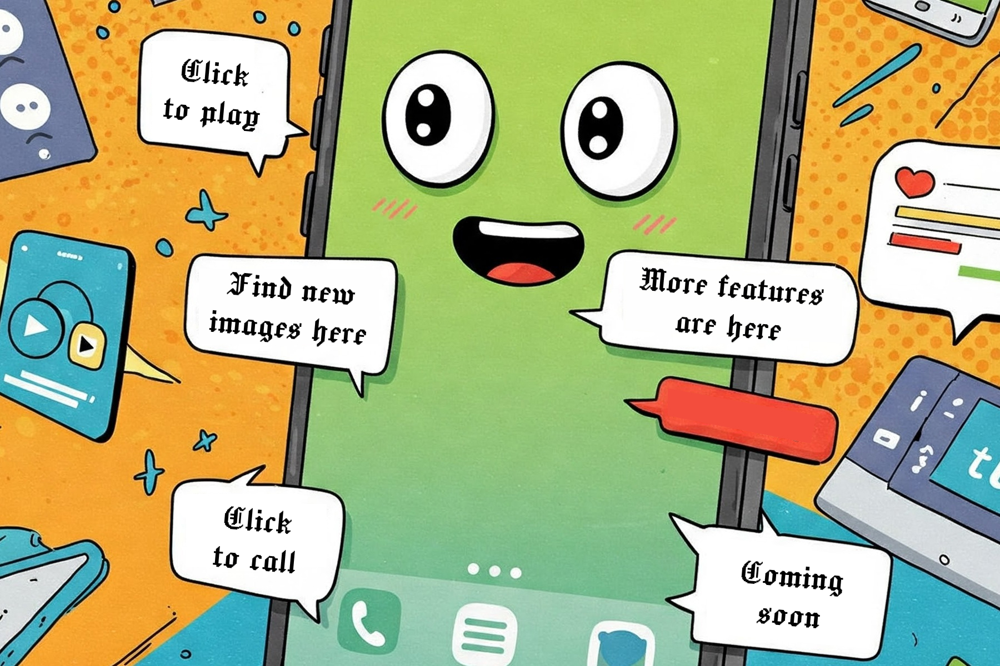
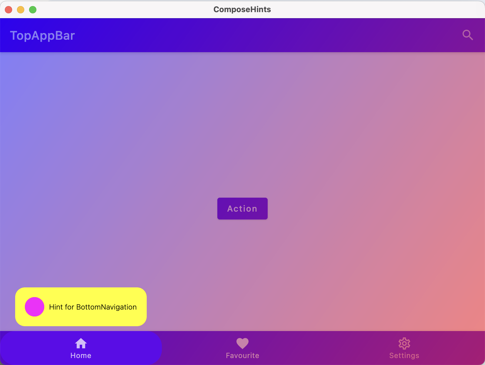

# ComposeHints



[](https://central.sonatype.com/search?namespace=com.viktormykhailiv&name=compose-hints)
[](http://kotlinlang.org)
[](https://kotlinlang.org/docs/multiplatform.html)
[](https://www.jetbrains.com/compose-multiplatform/)
[](https://github.com/vitoksmile/ComposeHints/blob/main/LICENSE.txt)

## What is ComposeHints?

ComposeHints is a Compose Multiplatform (Android, iOS, Web, Desktop) library to show hints /
tooltips, pointing to a particular UI element.



&emsp;&emsp;&emsp;
&emsp;&emsp;&emsp;&emsp;

## Quick Start

First add the dependency to your project:

```kotlin
repositories {
    mavenCentral()
}

dependencies {
    implementation("com.viktormykhailiv:compose-hints:$hints_version")
}
```

To show a hint we need the `HintController`, `Hint` composable, and `hintAnchor` Modifier along
with `HintAnchorState`:

```kotlin
val coroutineScope = rememberCoroutineScope()
val hintController = rememberHintController()

// Build UI for the hint
val hint = rememberHint {
    Text("Hello World")
}
// Create an anchor's state
val hintAnchor = rememberHintAnchorState(hint)

Button(
    modifier = Modifier
        // Configure the anchor
        .hintAnchor(hintAnchor, shape = RoundedCornerShape(16.dp))
        .padding(16.dp),
    onClick = {
        // Show the hint
        coroutineScope.launch {
            hintController.show(hintAnchor)
            // Do something here after the hint was shown
        }
    },
) {
    Text("Show hint")
}
```

> Note: Modifier ordering always matter in Compose, we set `16.dp` after `hintAnchor` modifier to
> have extra space around this button (the anchor's size will be bigger by 16.dp that the actual
> button's size).

## Customizations

### Show many hints

You are not limited in showing only 1 hint, HintController allows you to show either 1 or many hints
sequentially.

```kotlin
hintController.show(
    topAppBarActionHintAnchor,
    actionHintAnchor,
    bottomNavigationHintAnchor,
)
```

### Hint style

There are no limitations how your hints can look like. ComposeHints library uses "slot" approach
where you pass your own Composable content which should be shown as a hint. The library only
provides a possibility to draw an overlay, calculate anchor's coordinates, and clip shapes.

E.g. we can build an app specific hint implementation with background and some paddings.

```kotlin
@Composable
fun rememberHintContainer(content: @Composable () -> Unit): Hint {
    return rememberHint {
        Box(
            modifier = Modifier
                .padding(vertical = 8.dp)
                .background(Color.Yellow, shape = RoundedCornerShape(16.dp))
                .padding(16.dp),
        ) {
            CompositionLocalProvider(
                LocalTextStyle provides TextStyle(
                    color = Color.Black,
                    fontSize = 12.sp,
                    fontWeight = FontWeight.Light,
                ),
            ) {
                content()
            }
        }
    }
}
```

And in our apps we will our new `rememberHintContainer` composable:

```diff
// Build UI for the hint
-val hint = rememberHint {
+val hint = rememberHintContainer {
    Text("Hello World")
}
```

### Overlay color

Be default the background overlay has scrimColor as `Color(0x44000000)`. There is an option to
provide either a `Color` or `Brush`:

```kotlin
val hintController = rememberHintController(overlay = Color.Red)

// or set Brush:
val hintController = rememberHintController(
    overlay = Brush.linearGradient(
        listOf(
            Color.Blue.copy(alpha = 0.5f),
            Color.Red.copy(alpha = 0.5f),
        )
    )
)
```

### Clip shape

By default `RectangleShape` is used to provide a shape around anchors. `hintAnchor` modifier accepts
`Shape` as a parameter to override it.

```kotlin
Modifier.hintAnchor(hintAnchor, shape = RoundedCornerShape(16.dp))

Modifier.hintAnchor(hintAnchor, shape = CircleShape)
```

## Future plans

ComposeHints is under development and some features are missing:

- Animations
- Ignore statusBar and navigationBar on Android
